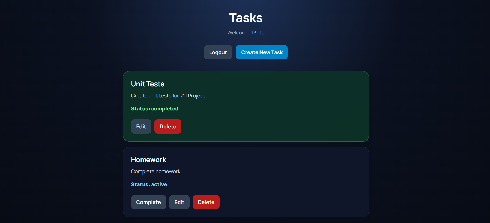

# TaskFlow — To-Do List

A full-stack task management app with an email OTP sign-in flow. Create an account, organize personal tasks, and track each task from active to completed.



## Features

- Register and sign in with email and password, followed by a one-time verification code sent by email.
- Create tasks with a title and description.
- View, edit, complete, and delete tasks.
- Keep task access scoped to the authenticated user; administrators can view all tasks.
- Use a React single-page frontend backed by a Laravel JSON API.

## Technology

| Area | Stack |
| --- | --- |
| Frontend | React 19, React Router 7, Axios, Vite 8 |
| Backend | PHP 8.2+, Laravel 10, Laravel Sanctum |
| API documentation | L5-Swagger / OpenAPI |
| Database | Any Laravel-supported database configured for the backend (MySQL by default) |

## Repository layout

```text
.
├── backend/       # Laravel API, migrations, mail, and tests
├── docs/images/   # Documentation screenshots
└── frontend/      # React application
```

## Requirements

- PHP 8.2 or later and Composer
- Node.js and npm
- A database supported by Laravel (MySQL is the configured default)
- A mail transport for delivering OTP verification codes

## Run locally

### 1. Configure the backend

```bash
cd backend
composer install
cp .env.example .env
php artisan key:generate
```

Edit `backend/.env` with your database connection and mail transport settings. OTP codes are emailed during registration and login, so configure `MAIL_*` values before using those flows. Set a local database name, user, and password in the `DB_*` variables as needed.

Run the migrations and start the API:

```bash
php artisan migrate
php artisan serve
```

The Laravel development server listens at `http://127.0.0.1:8000` by default, with API routes under `/api`.

### 2. Configure the frontend

In a second terminal:

```bash
cd frontend
npm install
```

Create `frontend/.env` and point the client at the Laravel API:

```dotenv
VITE_API_URL=http://127.0.0.1:8000/api
```

Start the Vite development server:

```bash
npm run dev
```

Open the local URL printed by Vite. The frontend stores the Sanctum bearer token in browser local storage and attaches it to API requests.

## API overview

The API is defined in `backend/routes/api.php`. Authentication is required for task and account management routes.

| Method | Endpoint | Purpose |
| --- | --- | --- |
| `POST` | `/api/auth/register` | Register and send an OTP |
| `POST` | `/api/auth/login` | Check credentials and send an OTP |
| `POST` | `/api/auth/verify-otp` | Verify the OTP and receive an access token |
| `GET` | `/api/auth/me` | Get the signed-in user |
| `POST` | `/api/auth/logout` | Revoke the current access token |
| `GET` | `/api/tasks` | List accessible tasks |
| `POST` | `/api/tasks` | Create a task |
| `PUT` | `/api/tasks/{task}` | Update a task |
| `POST` | `/api/tasks/{task}/complete` | Mark a task completed |
| `DELETE` | `/api/tasks/{task}` | Delete a task |

The OpenAPI definition is maintained in `backend/app/OpenApi/`. The Laravel Swagger UI route is configured by L5-Swagger; generate the documentation with `php artisan l5-swagger:generate` after installing backend dependencies.

## Development commands

```bash
# Frontend production build and lint
cd frontend
npm run build
npm run lint

# Backend test suite
cd backend
php artisan test
```

## License

No project-specific license is declared in the repository. Add a license before redistributing the project under specific terms.
